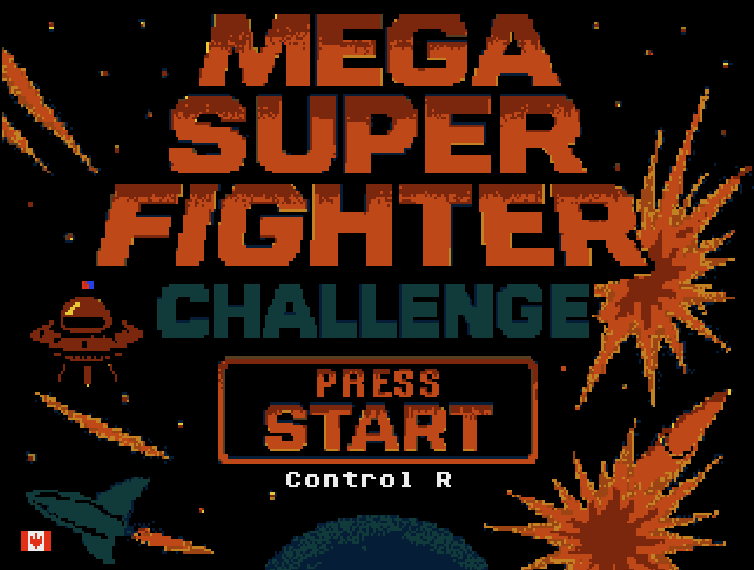
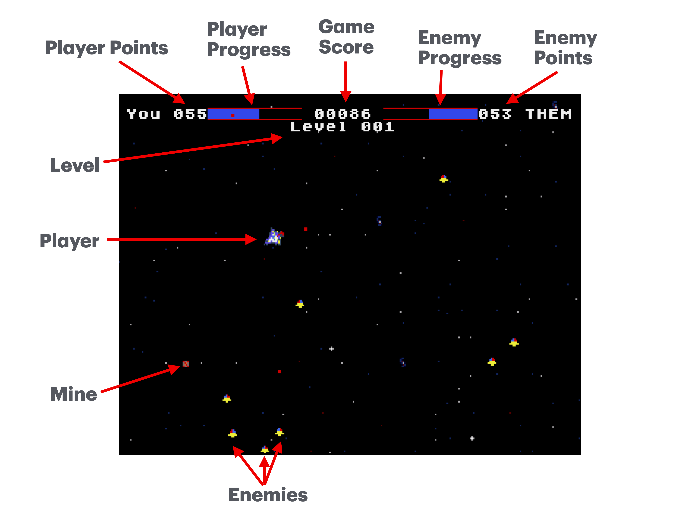

# Mega Super Fighter Challenge

## Overview
Dive into an epic space battle where you are the
last hope against an overwhelming armada of
alien ships. In Mega Super Fighter Challenge,
your mission is to destroy as many enemy ships
as possible before they can obliterate you. The
first player to reach 100 points triumphs in this
high-intensity space shooter.
Each level bring new challenges and new power-
ups.

Press **START** to begin the game.

Use the **LEFT** and **RIGHT** buttons on the **D-Pad**
to select your control style.

- **Control R**: Rotation control style that allows
for precision aiming. Your ship is **fast**.
- **Control D**: Direction control that provides
direct control over space craft direction but
limited aiming capacity. Your ship is **slow**.

## Gameplay
- **Objective:** Destroy enemy ships and amass 100 points. After each round points reset and
the race starts afresh.
**Controls:**

You select your control style at the Title Screen.
Hit **RESET** on the console if you want to change
your control scheme

**D-Pad Control R** (rotational style):
- **Up**: Move ship forward.
- **Left/Right**: Rotate direction of the ship.
- **Down**: Activate reverse engines to move
backward or slow down.

**D-Pad Control D** (directional style):
- **Up**: Move ship upwards.
- **Left**: Move ship to the left.
- **Right**: Move ship to the right.
- **Down**: Move ship down.

**Weapons and Abilities**
- **A Button:** Short boost of speed.
- **B Button:** Main gun (primary weapon).
- **C Button:** Spread gun (slow fire rate, additional firepower).
- **X Button:** Raise shield for a short duration. Weapons cannot be fired while the shield is raised.
- **Y Button:** Place a mine that arms itself after 0.5 seconds.

**Points:**
- Destroying basic enemy ships grants 1 point.
- Destroy an enemy ship using a mine grants 5
points
- Collide with an enemy ship while your shield
is up grants 5 points.
- If you collide with your own mine, you **lose** 10
points.
- The enemy gets 1 point if they shoot you or
collide with you when your shield is down.

**Game Score**

Game score is determined by skill. Trick
shots, careful use of mines and shields will net
you extra points.
- For example. destroying a basic enemy fighter
with your primary or secondary weapon is
worth minimal score.
- Drawing an enemy into a mine is worth much,
much more.
- Game score doesn’t count towards levelling
up.

## Heads Up Display ##

The game field HUD gives valuable information
about game play and status. Player and Enemy
points are shown as both a numerical value and a
growing blue bar. When the score of one side
gets close to 100 the progress bar will turn red to
indicate that one side is about to win.
The game score and game level are also shown.
Try to get the best score possible to impress your
friends.

## Enemies ##

Your basic enemy fighter.
Harmless on its own, but
can be overwhelming in
large numbers. Fires a
single shot towards the
enemy. Moves in
diagonal patterns
across the screen towards your
fighter craft.

Your Space Fighter
Your fighter is equipped the
all the tools necessary to
survive wave after wave
of enemies.
Use the **B** button to fire
your automatic primary
weapon. With its high rate of
fire, it is very effective against
fighters at close and far range.

The **C** button fires a spread shot of 3 projectiles.
It is very effective against close-by enemies and
enemies travelling in packs. It has a much slower
rate of fire.

To quickly evade enemies or close-ground for a
quick attack use the **A** button. This is will give
your craft a quick burst of speed. Be careful, as
collisions with fighters and mines can be a costly
mistake.

If you find yourself in trouble you have a short-
duration shield that you can raise using the **X**
button. This will save from collisions and enemy
fighters. The shield is ineffective against mines.

Space mines are powerful weapons. Use the **Y**
button to place a mine, but you better keep
moving because the mine will quickly arm itself
and will explode in the proximity of any craft,
including yourself. You can only place one mine
at a time. So don’t look track of it, as the fighters
will case you, not your mine.

## Collision Rules
If your spaceship crashes into an enemy ship, it
counts as a point for the enemy unless your
shields are raised. Raising your shield will protect
you from taking damage during collisions but
prevents you from firing any weapons while the
shield is active. Additionally, if you collide with
your own mine after it has armed itself, you lose
10 points.

Your shield will not protect you from mines.

## Levels
As you progress through levels, the difficulty
increases. Enemy ships become faster and more
numerous, requiring superior piloting skills and
strategic shooting. The ultimate challenge awaits
in later levels with powerful alien commanders
that demand precision and quick reflexes

## Game Over
If your spaceship is destroyed or you run out of
lives, the game ends. However, fear not! You can
restart and continue your battle against the ever-
growing hordes of enemies in hopes of achieving
victory.

## Technical Details
- **Platform:** Sega Genesis
- **Developer:** Jason Rowe
  - email: jason@jasonrowe.org
- **Release Date:** Alpha - 2025-05-29

